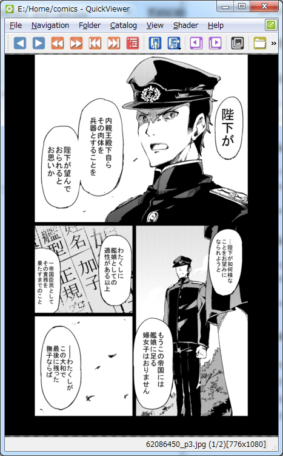

# シェーダーについて

QuickViewerの **シェーダー** メニューにあるオプションを変更すると、画像の見た目が変化します。
これは画像を縮小する補間方法を変更しているためです。

このページでは、それぞれのオプションでどのような違いがあるのかを説明します。

## まとめ

- 通常、多くの画像では **バイリニア補間** で問題ない
- 文字が読みづらかったり、日本のマンガを読むときは **CPUによるバイキュービック補間**
- **GPUによるバイリニアの後、CPUによるバイキュービック** を選択すると、描画速度と品質が両立するがフリッカーあり
- 上記のオプションで満足できない場合は **バイキュービックまたはLanczos補間**

## サンプル画像について

以下の説明で使用する縮小処理のサンプル画像として、日本のフリーコミックである『赤き血潮に』を使用しています。
作者の相生青唯(あいおい あおい)様より許諾を得ています。

作品ページは [赤き血潮に(www.pixiv.net)](https://www.pixiv.net/member_illust.php?mode=medium&illust_id=62086450)

この画像を[元画像](62086450_p3.jpg)としています。

### 1. バイリニア補間

QuickViewerの標準的な補間方法であり、多くの画像ではこのままで十分です。Windows Photo Viewerと似た表示になります。

### 2. バイキュービックとLanczos補間

これらのオプションではシェーダープログラム(フラグメントシェーダー)を使用することで、より高品質に描画することを試みます。
50-100%の拡大率の場合、バイリニア補間よりも良い結果を示すことが多いようです。

これらのオプションは通常よりもGPUの負荷が高いため、一部のPCでは正常に動作しません。

### 3. CPUによるバイキュービック補間

このオプションは、GPUではなくCPUによって縮小処理が行われます。通常最も良い品質になります。とりわけ日本のマンガでは。
GPUの機能を使わないため、古いPCでも正常に動作するでしょう。

あなたは描画があまり速くないと不満を感じるかもしれませんが、これでもベストを尽くしているんです :)

## 縮小結果の比較

